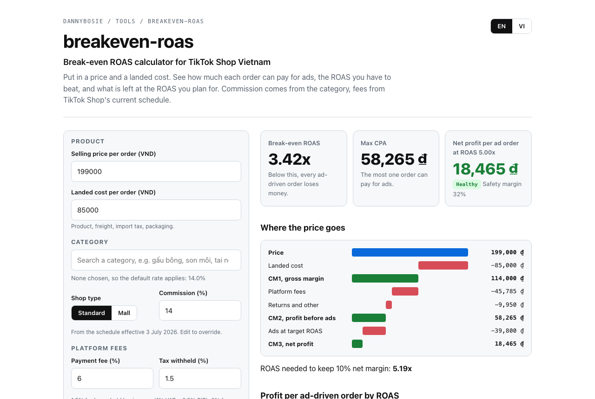

# breakeven-roas

**A break-even ROAS calculator for TikTok Shop Vietnam orders.** Put in a price and a landed cost. See how much each order can pay for ads, the ROAS you have to beat, and what is left at the ROAS you plan for, with commission looked up by category and fees from TikTok Shop's current schedule.

**[Open the calculator](https://dannybosie.github.io/breakeven-roas/)**, in English or Vietnamese. It runs in your browser, and a scenario can be shared as a link.

[](https://dannybosie.github.io/breakeven-roas/)

## Why

"What ROAS do we need?" is the first question in every ads review, and the answer is usually a rule of thumb. The real answer depends on the category's commission, the payment fee, the tax the platform withholds, Voucher Xtra, the flat order fee, returns and the affiliate cut, and on TikTok Shop Vietnam those changed three times in 2026. A ROAS target copied from last quarter can be a loss today.

This calculator does the arithmetic per order, from the current fee schedule, so the target comes from the unit economics instead of a guess.

## The model

For one order:

```text
CM1  = price - landed cost                               gross margin
CM2  = CM1 - platform fees - returns - other variable     profit before ads
Max CPA          = CM2                                   the most one order can pay for ads
Break-even ROAS  = price / Max CPA
Target CPA       = price / target ROAS
CM3  = CM2 - target CPA                                  net profit per ad-driven order
Safety margin    = (target ROAS - break-even ROAS) / target ROAS
ROAS for a margin m = price / (CM2 - m × price)
```

Platform fees are commission, payment fee, tax withheld, Voucher Xtra (capped per order), the flat order fee and any shipping the seller pays. Safety margin under 15% is **fragile**, under 30% is **watch**, above is **healthy**.

### Worked example

A 199,000 VND order with an 85,000 VND landed cost, standard shop, default category rate:

| | VND |
|---|---:|
| Price | 199,000 |
| Landed cost | -85,000 |
| **CM1** | **114,000** |
| Commission 14% | -27,860 |
| Payment fee 6% | -11,940 |
| Tax withheld 1.5% | -2,985 |
| Order fee | -3,000 |
| Returns 5% | -9,950 |
| **CM2, max CPA** | **58,265** |
| **Break-even ROAS** | **3.42x** |
| Ads at ROAS 5 (target CPA) | -39,800 |
| **CM3** | **18,465** (9.3%) |

At ROAS 5 the safety margin is 32%, which is healthy. Keeping a 10% net margin needs ROAS 5.19. The same order sold through an affiliate at 10% and also counted by ads loses 1,435 VND, which is the trap when an ads product and affiliates are credited for the same order.

## Defaults and data

| Input | Default | Source |
|---|---|---|
| Commission | By category, 2,039 categories, standard and Mall | TikTok Shop Vietnam schedule effective 3 July 2026 (Mall from 3 August 2026), from the open dataset [tiktok-shop-vn-commission-rates](https://github.com/dannybosie/tiktok-shop-vn-commission-rates) |
| Payment fee | 6% | From 9 May 2026 |
| Tax withheld | 1.5% | 1% VAT and 0.5% PIT for household businesses. Set 0 for companies |
| Voucher Xtra | 0%, or 4% capped at 50,000 VND per order | If the shop is enrolled |
| Order fee | 3,000 VND | Flat, per order |

These are defaults. Your seller center is the source of truth for your shop, and every input can be edited.

## Command line

```sh
npx github:dannybosie/breakeven-roas --price 199000 --cost 85000 --category "gau bong"
```

```text
Category          Mẹ & Bé › Đồ chơi & sở thích › Búp bê & Gấu bông › Gấu bông (13% standard)
Price             199,000 VND
CM1 gross margin  114,000 VND
Platform fees     -43,795 VND
Returns, other    -9,950 VND
CM2 before ads    60,255 VND   = max CPA
Break-even ROAS   3.30x
At ROAS 5.00x     CM3 20,455 VND per order (10.3%), healthy
ROAS for 10% net  4.93x
```

```sh
npx github:dannybosie/breakeven-roas categories tai nghe     # commission by category
npx github:dannybosie/breakeven-roas --price 350000 --cost 120000 --mall --roas 4 --json
```

## Relation to Ordinex

The model is the one behind [Ordinex](https://ordinex.cc)'s seller tools, rewritten here as a small open module, and checked to give the same results on the same inputs. For the question before this one, whether to import a product at all (sourcing in CNY, freight per batch, a price-war check), use the [import calculator on ordinex.cc](https://ordinex.cc/tools/tinh-gia-ban-tiktok-shopee?utm_source=github&utm_medium=referral&utm_campaign=breakeven-roas).

## Limits

- One order, one unit. Bundles and multi-unit orders spread the flat fees; model them as one order at the bundle price.
- Returns are a percentage of revenue. If returned stock cannot be resold, raise the rate to cover the landed cost too.
- Campaign fees (Flash Sale, LIVE programs, paid shipping programs) vary by program and are not included. Add them to "other variable cost".

## Development

```sh
npm install
npm test          # node:test: worked example, tiers, caps, category search
npm run build     # dist/cli.js and site/app.js, bundled with esbuild
```

## License

MIT for the code. The commission data is CC BY 4.0, from [tiktok-shop-vn-commission-rates](https://github.com/dannybosie/tiktok-shop-vn-commission-rates). Built by [Thinh Nguyen (Danny)](https://github.com/dannybosie).
